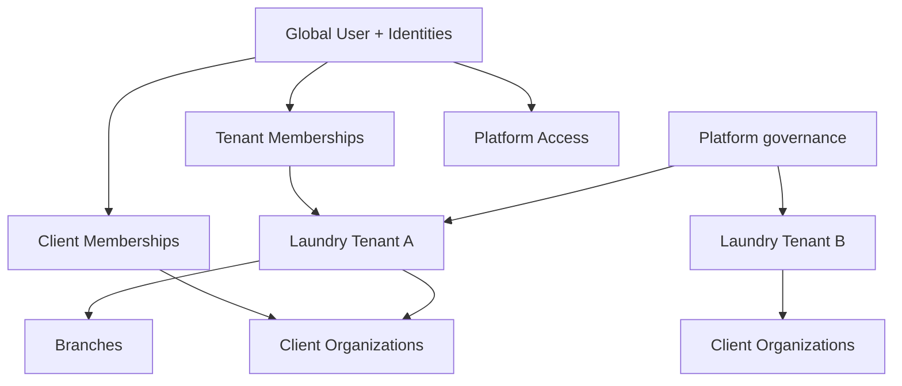
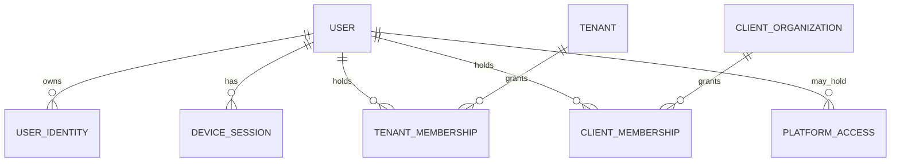
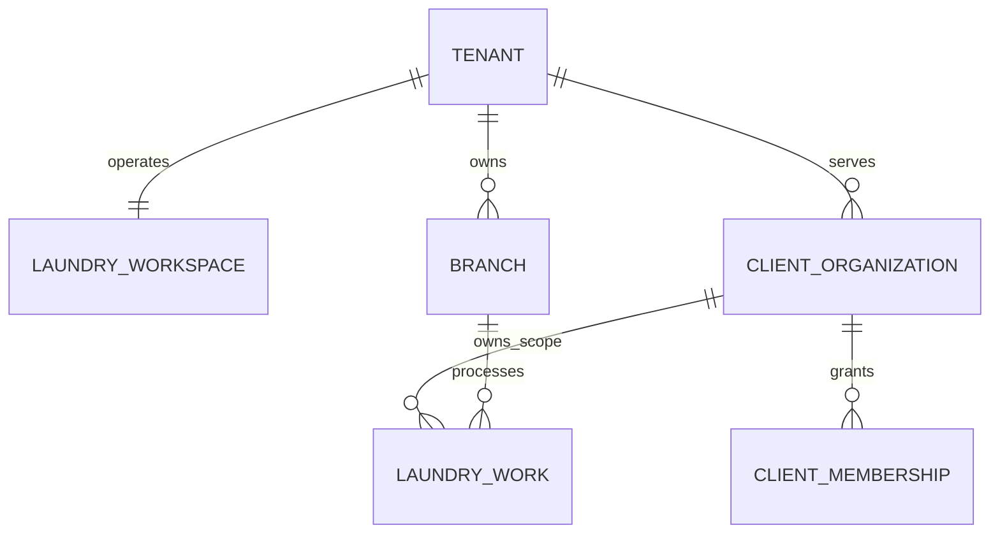
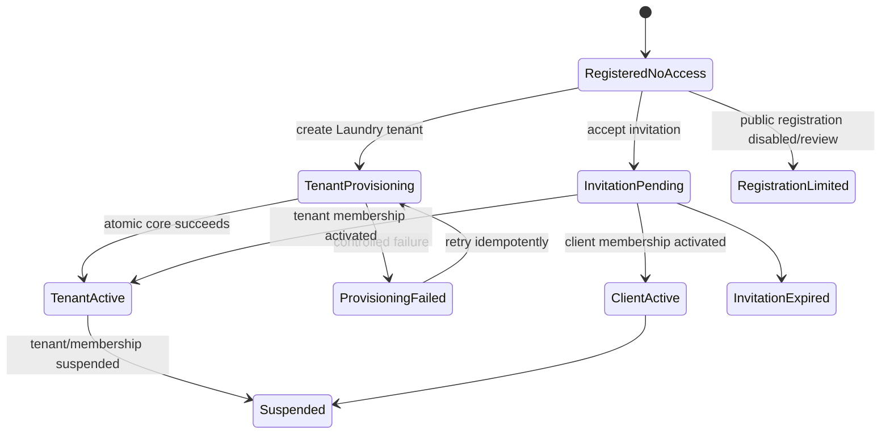
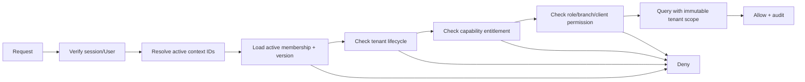

# SaaS Platform Foundation Blueprint V1

Status: APPROVED
Owner: Project Owner / Chief Architect
Authority: LOCKED_FOR_FOUNDATION_PLANNING; product implementation remains separately gated

## 1. Executive Summary

This approved architecture separates platform identity from business authorization and introduces explicit Laundry tenants, tenant memberships, branches, client organizations, invitations, subscriptions, entitlements, active context, and durable audit. It preserves the completed password, Google identity, device-session, and explicit-linking security boundaries while replacing the pilot's global `User.role`, `workspaceType`, and `resortId` authorization model incrementally.

Current implementation facts are labeled **CURRENT**. Approved future architecture is still not implemented. Google registration waits for foundation selection and creates only a passwordless User, Google identity, OnboardingJourney, and standard access session; it grants no tenant, client, or platform privilege.



## 2. Domain Vocabulary

- **Platform**: the SaaS operator and global governance boundary; not a tenant.
- **User**: a global human account, independent of authorization and businesses.
- **Identity**: a password or external provider authentication method owned by one User.
- **Platform Access**: exceptional platform-scoped role assignment such as SUPER_ADMIN.
- **Tenant**: the immutable security, ownership, commercial, and data-isolation boundary for one Laundry business.
- **Laundry Workspace**: the tenant's operational application surface. V1 is one-to-one with Tenant but remains a separate concept/model to permit lifecycle and product evolution.
- **Branch**: a physical or operational Laundry location owned by a Tenant through its LaundryWorkspace.
- **Tenant Membership**: a User's tenant-scoped role, status, and branch restrictions.
- **Client Organization**: a tenant-scoped business customer such as a Resort, Hotel, Hospital, Institution, or Other organization.
- **Client Membership**: a User's role within one Client Organization.
- **Active Context**: the explicitly selected tenant, membership, optional branch, and optional client organization used for a request.
- **Plan/Subscription/Entitlement**: commercial eligibility; distinct from operational permission.

## 3. Architectural Principles

1. Identity, authorization, tenancy, and commercial entitlement are separate.
2. Every tenant-owned record has an immutable `tenantId` or an equally strong parent-derived scope enforced in every query.
3. Provider claims never assign internal privilege.
4. Server-resolved membership is authoritative; client-supplied scope is only a requested context.
5. Platform roles never share the tenant role namespace.
6. Tenant creation and joining are explicit, auditable onboarding commands.
7. Commercial entitlement permits capability availability; membership permission authorizes the operation. Both must pass.
8. Cross-tenant access fails closed, including jobs, storage, caches, exports, integrations, and support tools.
9. Security-sensitive state changes are atomic where invariants require it and idempotent where retries are possible.
10. The pilot migrates incrementally through compatibility adapters, not a big-bang rewrite.

## 4. Identity Model

**CURRENT:** `User` stores email, non-null password hash, global role, workspace type, optional resort, and active state. A User can own multiple `UserIdentity` rows; `(provider, providerSubject)` is globally unique and durable after unlink.

**PROPOSED:** User retains global account facts only: id, normalized primary/contact email policy, display name, account status, security timestamps, and nullable password hash. Provider identities remain globally owned by exactly one User. Authorization moves to PlatformAccess, TenantMembership, and ClientOrganizationMembership.



Identity ownership cannot move automatically. Email matching may detect collision but never links or transfers. Password and Google remain independent usable methods. Account status disables authentication globally; membership status disables only its business scope.

## 5. Platform Administration Model

**PROPOSED:** `PlatformAccess(userId, role, status, provisionedBy, approvedBy, reason, expiresAt, createdAt, revokedAt)` uses roles SUPER_ADMIN, PLATFORM_SUPPORT, PLATFORM_BILLING, and PLATFORM_AUDITOR. It is absent for normal Users.

- SUPER_ADMIN provisioning is an internal, dual-control operation with strong MFA, short sessions, mandatory reason, immutable audit, and no public/invitation/promotion path.
- PLATFORM_SUPPORT has no default tenant access. Case-bound access is time-limited, reasoned, approved where required, and read-only by default.
- PLATFORM_BILLING sees commercial data, not operational content by default.
- PLATFORM_AUDITOR receives read-only audit access.
- Cross-tenant writes require explicit elevated grants; emergency access is time-boxed and reviewed.
- Support impersonation is **OPEN** and recommended to use delegated support sessions, never possession of the customer's credential or indistinguishable actions.
- Tenant administrators can never create, grant, revoke, or emulate platform access.

## 6. Tenant Model

**APPROVED:** Tenant and LaundryWorkspace are separate one-to-one entities.

`Tenant` owns security/commercial lifecycle: id, legal/display name, slug, status, region/timezone, createdBy, suspension data. `LaundryWorkspace` owns Laundry product configuration and operational lifecycle. Separation avoids making billing/security depend on one product surface and supports future tenant products without redefining Tenant.

Alternative: make Tenant equal LaundryWorkspace. It is simpler initially but couples security, billing, and product semantics. A fully independent many-workspace model is premature for V1.

Tenant statuses: PROVISIONING, TRIAL, ACTIVE, PAST_DUE, SUSPENDED, CANCELLING, CANCELLED, ARCHIVED. Suspension blocks tenant operations but preserves platform-governed recovery, billing, export/retention policy, and audit.

## 7. Laundry Workspace and Branch Model

**APPROVED:** one LaundryWorkspace per Tenant in V1. Branch is owned by the Tenant through LaundryWorkspace and has ACTIVE/SUSPENDED/ARCHIVED lifecycle, code unique within tenant, timezone/address, and optional default marker.

Operational records carry `tenantId`; branch-specific records also carry `branchId`. Tenant scope is never inferred from globally unique IDs alone. Tenant-wide roles may access all branches; restricted memberships use an explicit membership-branch join. New Laundry Tenant provisioning creates exactly one initial Branch inside the authoritative provisioning transaction. Identity registration alone creates no Branch.

## 8. Tenant Membership Model

`TenantMembership(userId, tenantId, status, primaryRole, positionTitle, invitedBy, activatedAt, suspendedAt, version)` with unique `(userId, tenantId)`.

Recommended roles: OWNER, MANAGER, STAFF, ACCOUNTANT, DRIVER; extensible via policy catalog rather than provider input. Statuses: INVITED, PENDING, ACTIVE, SUSPENDED, REVOKED. OWNER assignment occurs only through tenant provisioning or controlled ownership transfer. Managers may grant only roles allowed by governance. Branch restriction uses `MembershipBranch(membershipId, branchId)`; no rows means tenant-wide only when the role policy permits it.

One User may hold different roles in multiple tenants. Permission evaluation combines membership status, role policy, branch scope, tenant status, entitlement, and resource ownership.

## 9. Client Organization Model

**APPROVED:** ClientOrganization belongs to exactly one Laundry Tenant in V1 and replaces Resort as the general customer aggregate. Types: RESORT, HOTEL, HOSPITAL, INSTITUTION, OTHER. It stores tenantId, name, external/customer code, lifecycle, contacts, billing-contact metadata, and operational settings.



If the same legal business uses multiple Laundry tenants, create tenant-local operational organizations. A platform-level LegalOrganization remains **OPEN**. Direct sharing of one ClientOrganization record across Laundry Tenants is **DEFERRED** because it complicates ownership, billing, consent, and cross-tenant visibility.

Lifecycle: PROSPECT, ACTIVE, SUSPENDED, TERMINATED, ARCHIVED. `Resort` becomes the RESORT subtype/legacy projection during migration, not a permanent top-level tenant concept.

## 10. Client Organization Membership Model

`ClientOrganizationMembership(userId, clientOrganizationId, status, role, invitedBy, activatedAt, suspendedAt)` with unique `(userId, clientOrganizationId)`. Roles are CLIENT_ADMIN, CLIENT_OPERATOR, CLIENT_VIEWER, CLIENT_BILLING. Membership cannot exist unless the organization belongs to an active eligible Tenant.

Client users see only their organizations and explicitly permitted operational records. They receive no Laundry tenant role. Client admins cannot alter Laundry membership, tenant configuration, platform roles, or unrelated client organizations.

## 11. Onboarding State Machine

A newly registered User has no business authorization. Onboarding state may be derived from memberships/invitations plus a resumable `OnboardingJourney` for UX and idempotency.

Registration availability is configuration-controlled with modes `DISABLED`, `INVITATION_ONLY`, and `PUBLIC_LAUNDRY_ONBOARDING`. The default production recommendation is `INVITATION_ONLY`. A valid invitation routes registration into invitation acceptance. A new User without an invitation may enter explicit Laundry Tenant onboarding only when `PUBLIC_LAUNDRY_ONBOARDING` is enabled; otherwise onboarding remains limited.



Incomplete onboarding never grants operational access. Rejected/expired invitations remain auditable. A suspended tenant overrides otherwise active memberships.

## 12. Tenant Provisioning Flow

```mermaid
sequenceDiagram
  participant U as Authenticated User
  participant O as Onboarding Service
  participant DB as Database Transaction
  participant E as Entitlement Service
  participant J as Async Jobs
  U->>O: Create Laundry tenant command + idempotency key
  O->>DB: Create Tenant + Workspace + Owner Membership
  O->>DB: Create mandatory initial Branch
  O->>DB: Create Trial Subscription + baseline entitlements
  DB-->>O: Commit core provisioning
  O->>J: Enqueue notifications/setup via outbox
  O-->>U: Tenant created; select active context
  J->>E: Materialize optional derived configuration
```

The authoritative transaction includes Tenant, LaundryWorkspace, exactly one initial Branch, OWNER TenantMembership, initial Trial Subscription, onboarding completion marker, transactional outbox events, and idempotency record. External billing-customer creation, notifications, analytics, integrations, search indexes, sample data, and nonessential configuration are post-commit eventual work. External calls never occur inside the database transaction.

## 13. Invitation Model

Invitation is scoped to exactly one target: TenantMembership or ClientOrganizationMembership. It stores hashed single-use token, normalized invited email, intended role, target scope, inviter, expiry, status, and acceptance audit. Acceptance requires authenticated email/identity policy and rechecks inviter authority and target lifecycle.

**APPROVED:** support invitation-before-registration and registration-before-invitation. A valid invitation routes a newly registered User into invitation acceptance; existing Users accept directly. Neither path grants access until transactional acceptance. Invitations cannot create platform access or OWNER except an explicitly governed ownership-transfer flow.

## 14. Passwordless Account Model

**APPROVED:** make `User.passwordHash` nullable in the future passwordless foundation. A Google-registered User has one active Google identity and no password until explicit password enrollment. Never store a fake/random password hash as a substitute for nullability.

Password enrollment requires an authenticated, recent/step-up context and verified recovery policy. A User must always retain at least one usable authentication method. Unlinking/removal counts active identities, password presence, and future passkeys transactionally and rejects removal of the final method. Existing password Users migrate without behavioral change. Platform MFA and recovery policy remains **OPEN**.

## 15. Subscription and Plan Model

Minimum concepts:

- `Plan`: versioned commercial offering and lifecycle.
- `PlanEntitlement`: feature key, enabled state, limit/value.
- `Subscription`: tenant, plan version, status, trial/period/grace/cancel timestamps, external billing reference.
- `TenantEntitlementOverride`: approved enable/disable/limit override with reason and expiry.
- `UsageCounter`: tenant, metric, period, quantity, version/source.

Statuses: TRIALING, ACTIVE, PAST_DUE, GRACE, SUSPENDED, CANCELLING, CANCELLED. Payment-provider details are outside this blueprint. Billing references are opaque and provider-neutral.

## 16. Feature Entitlement Model

The platform FeatureCatalog defines stable feature keys. Plan entitlements define commercial defaults. Tenant overrides support contracts, pilots, and emergency disablement. Rollout flags control technical exposure by environment/cohort/tenant and are not billing authority.

Capability check order: tenant lifecycle → rollout availability → commercial entitlement/limit → membership operational permission → resource scope. UI hints are not enforcement. Usage increments are idempotent and tenant-scoped.

## 17. Multi-Tenant Authorization Model

Authorization resolves a trusted ActiveContext and resource scope server-side. IDs supplied by clients are never enough. Repositories require tenant scope explicitly; service methods cannot call unscoped tenant-owned queries. Cross-tenant mismatch returns a non-enumerating not-found/forbidden policy response.



## 18. Session and Active-Context Model

**APPROVED hybrid active-context JWT:** include stable User id, session id/security version, active tenant id, membership id, optional branch/client-membership context, and short expiry. Do not embed the complete permission graph. Server resolution validates membership status/version, tenant status, and sensitive permissions.

Context selection is an explicit authenticated command that issues a new access token; it never changes identity or durable device credential. Membership change/revocation increments a version or revocation marker. High-risk endpoints always read current authorization state. Short token TTL limits stale low-risk claims; suspension/revocation can reject immediately through server state/cache invalidation.

Platform sessions are distinct or explicitly elevated, shorter-lived, MFA-bound, and cannot silently reuse tenant context.

## 19. Audit and Support Governance

Introduce append-only `AuditEvent` with actor User, actor type, platform/tenant/client scope, action, target type/id, reason, request/correlation id, before/after safe metadata, source, support case, and timestamp. Sensitive credentials and provider subjects are prohibited.

Mandatory audit: platform access changes, tenant provisioning/status, membership/role/branch changes, client organization/membership changes, identity link/unlink, subscription/entitlement changes, invitation lifecycle, impersonation/delegation, exports, emergency access, and sensitive support actions. Audit retention, tamper evidence, and export controls require policy approval.

## 20. Data Isolation Rules

- Every tenant aggregate root carries immutable tenantId; children either carry tenantId too for safe querying or are reachable only through enforced scoped parents. High-risk/high-volume operational rows should carry tenantId directly.
- All unique business keys become tenant-composite unless truly platform-global.
- Object-storage keys begin with immutable tenant namespace; signed access verifies current scope.
- Cache keys, locks, queues, metrics labels, exports, search indexes, webhooks, and integration credentials include tenant scope.
- Background jobs carry tenantId and revalidate tenant status; no ambient tenant context.
- Logs may include tenantId for correlation but never secrets/provider subjects; access to logs is governed.
- Tenant suspension blocks mutations and ordinary access consistently; approved billing/support/recovery paths are explicit.

Suspended Tenant policy: block normal writes; preserve login and controlled read/export; require an audited platform override for emergency access.

## 21. Transaction Boundaries

Atomic transactions are required for: Google User+Identity creation; invitation acceptance+membership activation; tenant core provisioning; ownership transfer; membership role/status change plus audit/outbox; subscription state plus authoritative entitlement changes; final-authentication-method removal checks.

Use unique constraints, conditional writes, idempotency keys, and an outbox. External billing, email, storage, and analytics calls are eventual. Failed eventual work must be retryable without duplicating authority records.

## 22. Error and Conflict Policy

Expected conflicts never become HTTP 500. Use stable codes for duplicate identity/email, invitation state, tenant slug, membership collision, stale context, suspended scope, missing entitlement, limit exceeded, idempotency mismatch, and concurrency conflict. Public authentication errors minimize account enumeration; authenticated onboarding may provide recoverable guidance without exposing another owner's data.

## 23. Compatibility with Current System

**CURRENT:** role/workspace/resort/active claims are signed into access JWTs; middleware trusts them after signature validation. Laundry policies expect global Laundry roles. Resort access uses `resortId`. Operational tables generally scope by Resort but have no Laundry tenant id. Work numbers and several configuration codes are globally unique.

A compatibility actor adapter must derive legacy `role`, `workspaceType`, and `resortId` from the selected membership/context while old routes migrate. Existing tokens remain valid only for the approved transition window. Google login, password login, explicit linking, Session Storage, and device-session rotation remain unchanged.

## 24. Incremental Migration Strategy

```mermaid
flowchart LR
  P0[0: Approve domain policy] --> P1[1: Add Tenant/Membership foundation]
  P1 --> P2[2: Backfill pilot tenant + memberships]
  P2 --> P3[3: Context resolver + compatibility actor]
  P3 --> P4[4: Add tenantId to aggregates and dual-write]
  P4 --> P5[5: Migrate reads/routes by vertical slice]
  P5 --> P6[6: Client Organization migration]
  P6 --> P7[7: Subscription/entitlement enforcement]
  P7 --> P8[8: Remove legacy User authorization fields]
```



Backfill creates one pilot Tenant/Workspace, maps Laundry Users to memberships, maps Resort Users to client memberships, and attaches existing operational data. Each phase needs reconciliation, cross-tenant negative tests, rollback strategy, and observability. Legacy fields remain read-only compatibility projections before removal.

## 25. Google Registration Placement

`POST /api/auth/google/register` is explicit and separate from completed Google login. It verifies Google, rejects owned/colliding identity or email without auto-linking, and atomically creates only User, Google UserIdentity, and OnboardingJourney, then issues the standard access session. It creates no Tenant, Branch, ClientOrganization, TenantMembership, operational role, or PlatformAccess. A valid invitation routes to invitation acceptance; otherwise an eligible public registration routes to explicit Laundry Tenant onboarding.

Mandatory before implementation: nullable password model; no-access User/session support; atomic User+Identity repository transaction; collision/error policy; onboarding destination; registration availability policy; actor/session support for a User with no active business context.

## 26. SuperAdmin Governance

**APPROVED:** separate PlatformAccess relation, never a User global role and never a TenantMembership. SuperAdmin and other platform roles are separately provisioned and cannot arise through public registration, invitation, Tenant promotion, provider claims, or email matching. Detailed platform MFA/recovery remains **OPEN**. Production access is least-privilege, reasoned, reviewed, and audited.

## 27. Security Invariants

- Google/password authentication proves User identity only.
- No public path creates platform or business privilege.
- Every protected business operation resolves current scope and permission server-side.
- Tenant/client IDs cannot override trusted context.
- Provider credentials, tokens, subjects, device credentials, and secrets never enter frontend storage, URLs, user-facing responses, or logs.
- UserIdentity ownership is unique and never silently transferred.
- One active business context is explicit per access session.
- Tenant suspension and membership revocation fail closed.
- Cross-tenant tests are required for every migrated aggregate.
- Support access is exceptional, scoped, time-bound, reasoned, and audited.

## 28. Non-Goals

- Payment-provider implementation
- Tax/accounting ledger design
- Cross-tenant shared operational records in V1
- Generic standalone CUSTOMER accounts
- Automatic tenant/client creation during identity verification
- Automatic employee, owner, client, or platform privilege
- Rewriting unrelated Laundry workflows in one release
- Final data-retention, regional residency, or enterprise SSO design

## 29. Open Business Decisions

- **OPEN:** platform-level LegalOrganization.
- **OPEN:** support delegated-session/impersonation approval and customer visibility.
- **OPEN:** platform MFA technology and recovery governance.
- **OPEN:** plan catalog, trial duration, grace period, and default limits.
- **OPEN:** verified-email collision wording and recovery journey.
- **OPEN:** audit retention and tamper-evidence standard.
- **OPEN:** billing-provider integration.
- **DEFERRED:** direct multi-Laundry legal-client sharing and one shared ClientOrganization record.

## 30. Recommended Delivery Phases

1. Approve domain vocabulary and decision candidates.
2. Add identity-safe User evolution, Tenant, Workspace, Membership, Invitation, and Audit foundations.
3. Backfill the pilot and introduce ActiveContext/compatibility authorization.
4. Implement minimum no-access onboarding and Google registration.
5. Add explicit Tenant provisioning and Branch governance.
6. Generalize Resort to ClientOrganization and migrate client users.
7. Tenant-scope operational aggregates slice by slice.
8. Add subscription, entitlement, usage, and rollout services.
9. Add controlled platform administration/support governance.
10. Remove legacy global authorization fields after reconciliation and full verification.

Architecture Direction: LOCKED_FOR_FOUNDATION_PLANNING
Product Implementation: NOT_STARTED
Google Registration: WAITING_FOR_FOUNDATION_SELECTION
